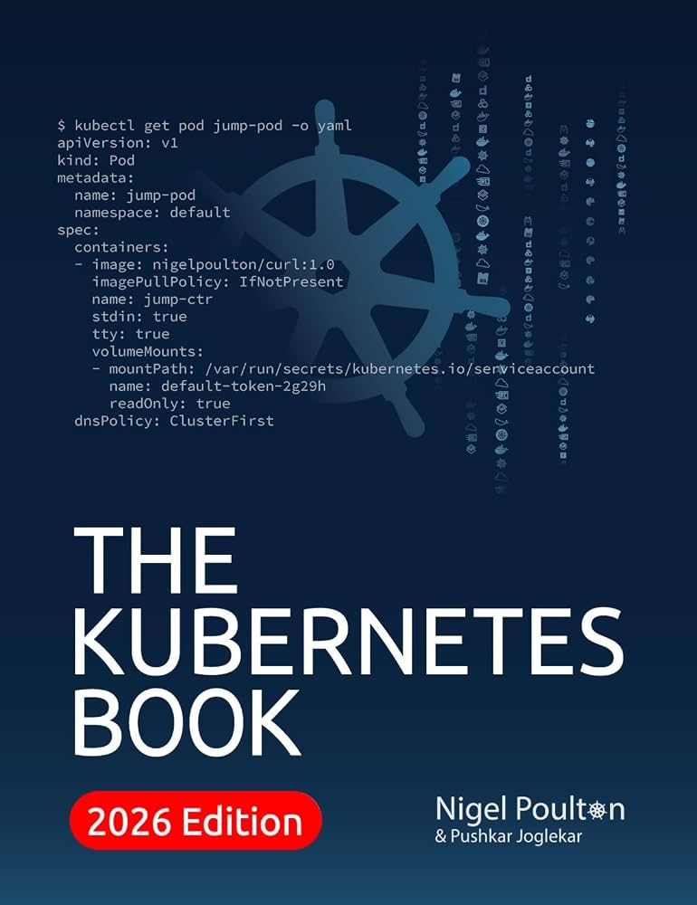

# The Kubernetes Book: 2026 Edition

The Kubernetes Book is a very good introductory book to get your hands dirty in the Kubernetes landscape. Almost all chapters have interesting lab-focus exercises that help you to grasp much better the inner workings of core resources you can deploy into a Kubernetes cluster.

With this book, you are going to be able to understand in high-level:

* Pods
* Deployments
* StatefulSets
* Services
* Gateway API
* ConfigMaps and Secrets
* StorageClasses and other type of classes
* Server API
* Kubernetes Networking
* Kubernetes Hardening
* And more...

You can adquire this book through this [link](https://www.amazon.com/Kubernetes-Book-Version-November-2018-ebook/dp/B072TS9ZQZ/ref=sr_1_6?sr=8-6).

## Book Cover

